# 🏥 Hospital Management System — MySQL Project

> A comprehensive relational database system for managing hospital operations including patients, doctors, appointments, billing, and medical records — built entirely with MySQL.

---

## 📋 Table of Contents

- [Project Overview](#-project-overview)
- [Database Schema](#-database-schema)
- [Key Features](#-key-features)
- [Setup & Installation](#-setup--installation)
- [SQL Query Highlights & Results](#-sql-query-highlights--results)
- [Data Analysis & Insights](#-data-analysis--insights)
- [Technologies Used](#-technologies-used)
- [Project Structure](#-project-structure)

---

## 🔍 Project Overview

The **Hospital Management System** is a MySQL-based relational database project designed to simulate real-world hospital operations. It covers everything from patient registration and doctor scheduling to billing workflows, medical record management, and advanced analytical queries using window functions and subqueries.

| Metric | Value |
|--------|-------|
| 📦 Total Tables | 6 |
| 👤 Patients | 31 |
| 🩺 Doctors | 16 |
| 📅 Appointments | 61 |
| 🧾 Billing Records | 16 |
| 🏢 Departments | 8 |
| 💰 Total Revenue | ₹12,100.00 |

---

## 🗃️ Database Schema

```
Hospital_mgmt_sys
├── Patients           — Patient demographics & registration
├── Doctors            — Doctor profiles, specialization & fees
├── Appointments       — Patient-doctor appointment records
├── Medical_Records    — Diagnoses, prescriptions & hospital stays
├── Billing            — Invoices, payments & payment status
├── Departments        — Hospital departments
└── Doctor_Department  — Many-to-many: doctors ↔ departments
```

### Entity Relationships

```
Patients ──< Appointments >── Doctors
Patients ──< Billing
Appointments ──< Billing
Patients ──< Medical_Records >── Doctors
Doctors ──< Doctor_Department >── Departments
```

**Foreign Key Constraints Enforced:**
- `Medical_Records.patient_id` → `Patients(patient_id)`
- `Medical_Records.doctor_id` → `Doctors(doctor_id)`
- `Billing.appointment_id` → `Appointments(appointment_id)`
- `Doctor_Department.doctor_id` → `Doctors(doctor_id)`
- `Doctor_Department.department_id` → `Departments(department_id)`

---

## ✨ Key Features

### 🔧 CRUD Operations
- **Insert** new patients, doctors, and appointments dynamically
- **Update** patient address and profile information
- **Delete** stale cancelled appointments older than 6 months using `DATE_SUB`

### 🔗 Joins
- **INNER JOIN** — Doctor names with their department names
- **LEFT JOIN** — Patients with completed appointments
- **RIGHT JOIN** — Appointments with no associated payment records
- **FULL OUTER JOIN** (via UNION) — Patients who never booked an appointment

### 📊 Aggregations & Grouping
- Total revenue per department using multi-table joins
- Patient count per doctor
- Monthly revenue with cumulative totals via `SUM() OVER`

### 🪟 Window Functions
- `RANK() OVER` — Doctor ranking by patient load
- `SUM() OVER` — Cumulative/running revenue totals
- Month-wise revenue with rolling cumulative sum

### 📅 Date Functions
- `MONTHNAME()`, `MONTH()`, `DATEDIFF()`, `DATE_FORMAT()`, `DATE_SUB()`
- Hospital stay duration calculation (admission → discharge)
- Formatted treatment dates

### 🔤 String Functions
- `UPPER()` — Patient name formatting
- `TRIM()` — Doctor name cleanup
- `REPLACE()` — Handling missing phone numbers

### 🧠 CASE Expressions
- **Doctor Experience Level:** Senior / Mid-Level / Junior
- **Patient Risk Level:** High / Medium / Low (based on medical record count)

### 🔍 Subqueries
- Top spender via correlated `HAVING SUM >= ALL(...)` subquery
- Patients who haven't visited in the last year using `NOT IN`

---

## ⚙️ Setup & Installation

### Prerequisites
- MySQL Server 8.0+
- MySQL Workbench or any SQL client (DBeaver, TablePlus, etc.)

### Steps

```bash
# 1. Clone or download this repository
git clone https://github.com/your-username/hospital-mgmt-sys.git

# 2. Open your MySQL client and run the SQL file
mysql -u root -p < Hospital_mgmt_sys.sql

# OR in MySQL Workbench:
# File → Open SQL Script → Hospital_mgmt_sys.sql → Execute All
```

The script will:
1. Create the `Hospital_mgmt_sys` database
2. Create all 6 tables with proper constraints
3. Insert sample data (patients, doctors, appointments, billing, etc.)
4. Execute all analytical queries

---

## 🖼️ SQL Query Highlights & Results

### 1. 👨‍⚕️ Doctor Experience Level Classification

Using a `CASE` expression to categorize doctors into Senior (>15 yrs), Mid-Level (5–15 yrs), and Junior (<5 yrs).


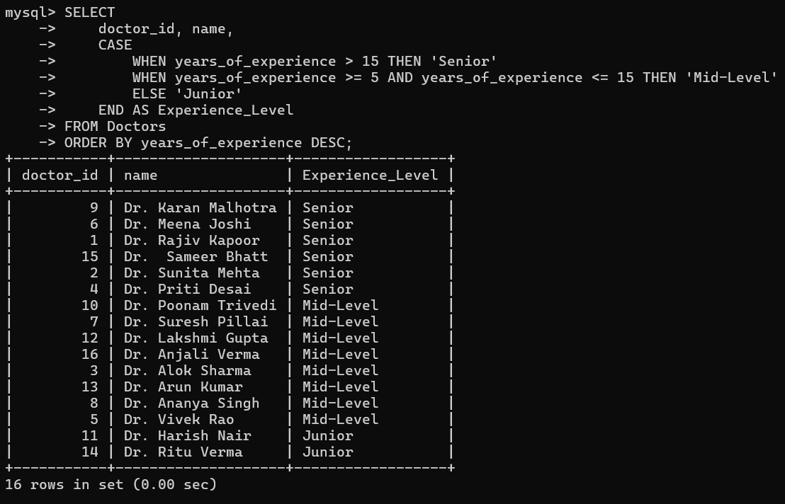

**Result:** 6 Senior doctors, 8 Mid-Level doctors, 2 Junior doctors out of 16 total.

---

### 2. 💰 Top 5 Highest Paying Patients


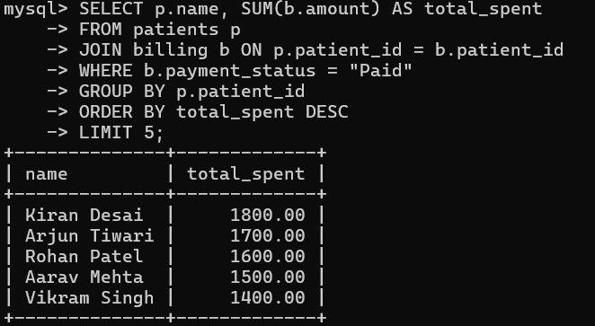

**Result:** Kiran Desai leads with ₹1,800, followed by Arjun Tiwari (₹1,700) and Rohan Patel (₹1,600).

---

### 3. 🔐 Foreign Key Integrity — Medical Records

Enforcing referential integrity by linking Medical Records to both Patients and Doctors.

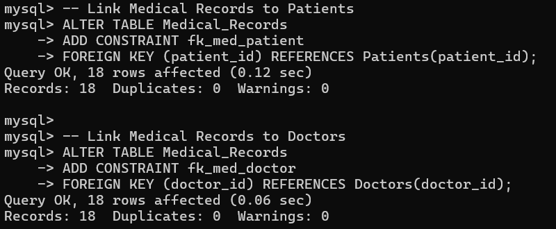

**Result:** Both constraints applied successfully — 18 rows affected with 0 duplicates and 0 warnings.

---

### 4. 📈 Monthly Revenue with Cumulative Totals (Window Function)


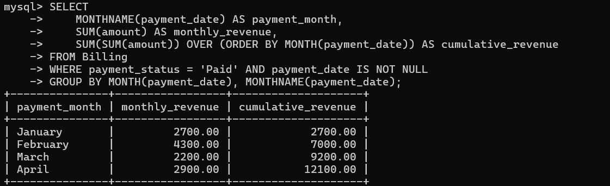
---

### 5. 🏆 Most Visited Doctor

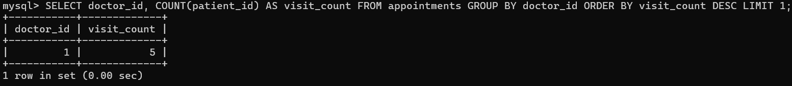

**Result:** Doctor ID `1` (Dr. Rajiv Kapoor, Cardiology) leads with **5 patient visits**.

---

### 6. 📊 Patient Count Per Doctor


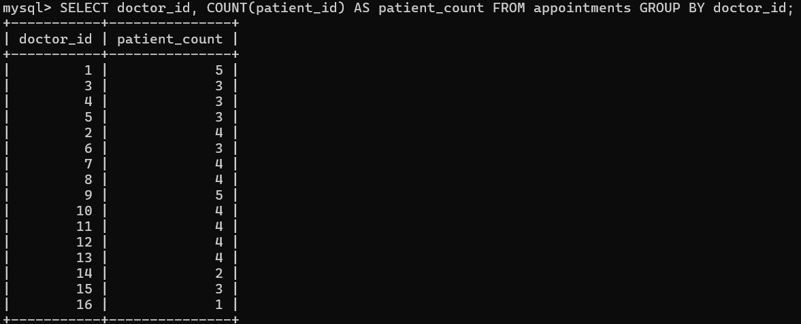

**Result:** Most doctors handle 3–4 patients, with Doctors 1 and 9 being the busiest at 5 each.

---

### 7. 🚨 Patient Risk Level Classification

Categorizing patients based on their total medical record count using `CASE` + `LEFT JOIN`.


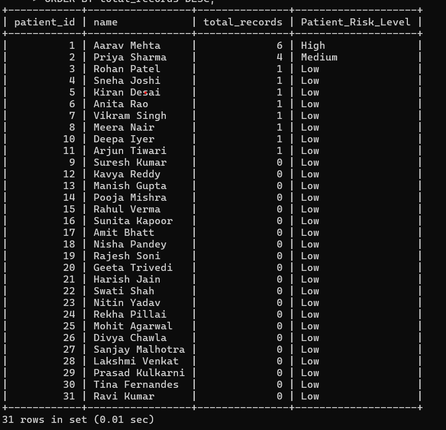

**Result:** Aarav Mehta is the only **High-risk** patient (6 records), Priya Sharma is **Medium** (4 records), and the rest are **Low**.

---

### 8. 🧴 Dermatology Appointments

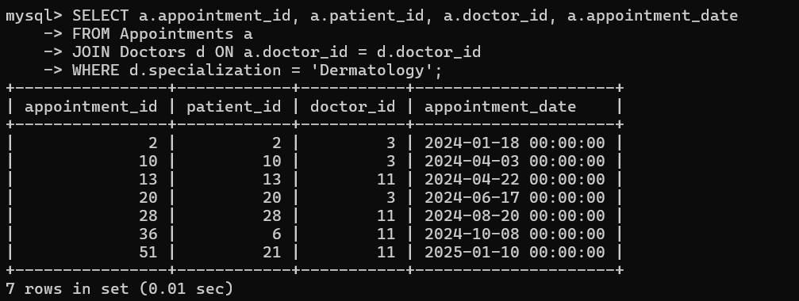

**Result:** 7 appointments handled by Dermatology specialists (Doctors 3 and 11).

---

### 9. 👑 Patient with Highest Total Spend (Subquery)

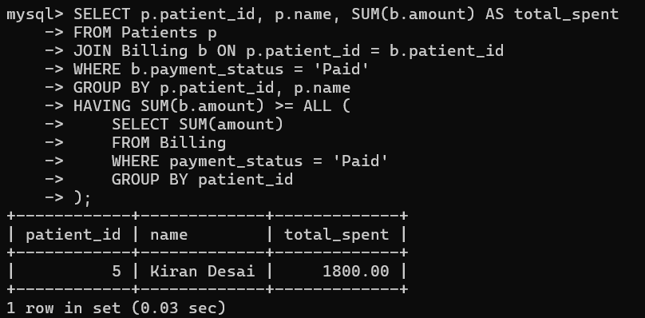

**Result:** **Kiran Desai** is the top spender with ₹1,800.00 in paid invoices.

---

### 10. 🏢 Revenue Per Department

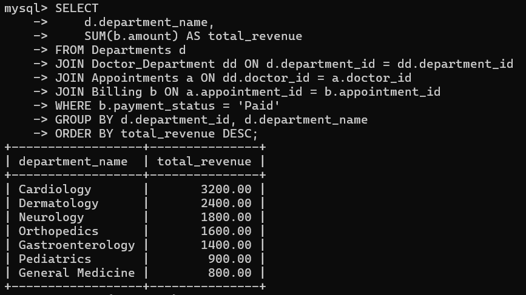
---

### 11. 🫀 Cardiology & Neurology Specialists


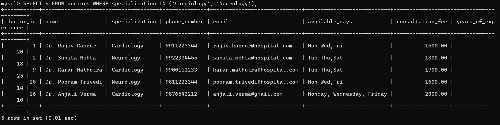

**Result:** 5 doctors — 3 Cardiologists and 2 Neurologists — with fees ranging from ₹1,500 to ₹2,000.

---

### 12. 💵 Total Hospital Revenue


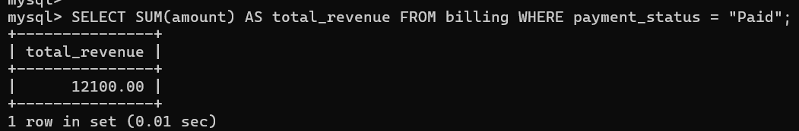

**Result:** **₹12,100.00** in total paid revenue collected across all departments.

---

## 📊 Data Analysis & Insights

### 💡 Revenue Insights
- **Total Revenue Collected:** ₹12,100
- **Top Revenue Department:** Cardiology (₹3,200 — 26.4% of total)
- **Lowest Revenue Department:** General Medicine (₹800)
- **February** was the highest revenue month at ₹4,300, nearly double January

### 👨‍⚕️ Doctor Performance
- **Most Visited:** Dr. Rajiv Kapoor (Doctor ID 1) — 5 appointments
- **Highest Experience:** Dr. Karan Malhotra — 25 years (Senior)
- **Junior Doctors:** Only 2 out of 16 (Dr. Harish Nair, Dr. Ritu Verma)
- **Most Expensive:** Dr. Meena Joshi & Dr. Anjali Verma at ₹2,000/consultation

### 🤒 Patient Insights
- **Highest Spending Patient:** Kiran Desai — ₹1,800
- **Highest Risk Patient:** Aarav Mehta — 6 medical records (High Risk)
- **Total Patients Registered:** 31 across Ahmedabad & Gandhinagar
- Most patients have **Low risk** (0–2 medical records)

### 🏥 Operational Insights
- **Appointment Completion Rate:** ~78% (Completed), ~15% Cancelled, ~7% Scheduled
- **Dermatology** handled 7 appointments — 3rd most active department
- 3 patients have **never booked** an appointment (identified via FULL OUTER JOIN)
- Cancelled appointments older than 6 months are automatically cleaned via DELETE

---

## 🛠️ Technologies Used

| Technology | Purpose |
|------------|---------|
| **MySQL 8.0** | Primary database engine |
| **MySQL Workbench** | Query execution & schema design |
| **SQL DDL** | Table creation, constraints, foreign keys |
| **SQL DML** | INSERT, UPDATE, DELETE operations |
| **Window Functions** | RANK(), SUM() OVER for analytics |
| **Subqueries** | Nested SELECT for comparisons |
| **CASE Expressions** | Conditional classification logic |
| **Date Functions** | MONTHNAME, DATEDIFF, DATE_FORMAT |

---

## 📁 Project Structure

```
hospital-mgmt-sys/
│
├── Hospital_mgmt_sys.sql     # Full database script (DDL + DML + Queries)
├── README.md                 # Project documentation (this file)
│
└── screenshots/
    ├── exp_level.png                              # Doctor experience classification
    ├── high_pay_ptnts.png                         # Top 5 paying patients
    ├── medical_records_linked_with_correct_ptnt_dr.png  # FK constraints result
    ├── monthly_revenue.png                        # Monthly + cumulative revenue
    ├── most_visited_dr.png                        # Most visited doctor
    ├── patient_count_per_dr.png                   # Patient count per doctor
    ├── ptnt_risk.png                              # Patient risk classification
    ├── ptnt_with_dermatology.png                  # Dermatology appointments
    ├── ptnt_withmost_spent.png                    # Top spending patient
    ├── revenue_each_department.png                # Revenue by department
    ├── sp_in_card_neur.png                        # Cardiology & Neurology doctors
    └── total_revenue.png                          # Total hospital revenue
```


## 👤 Author
Chirag Modi

**Hospital Management System — SQL Project**  
>Built with ❤️ using MySQL 

---

*This project demonstrates practical SQL skills including schema design, multi-table joins, window functions, subqueries, CASE logic, date manipulation, and data integrity enforcement.*